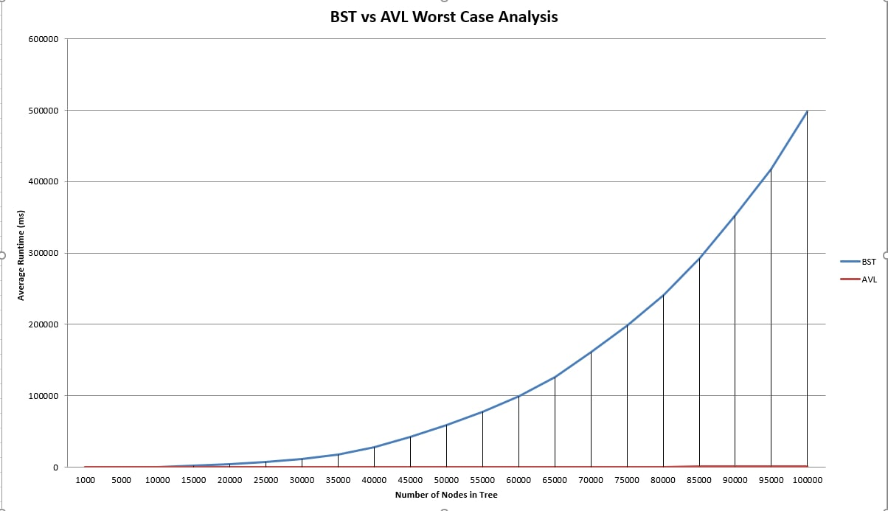
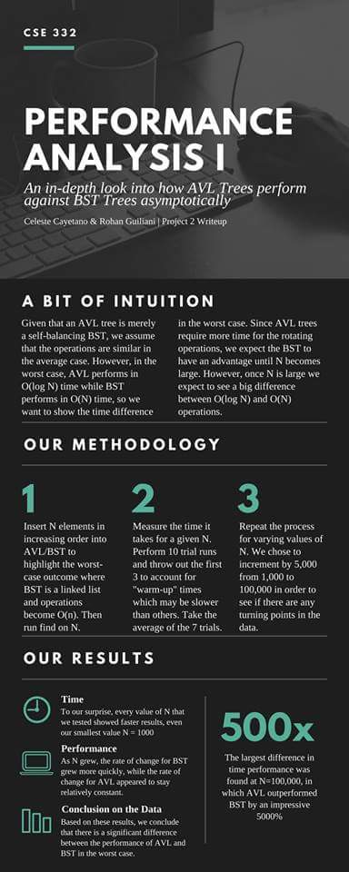
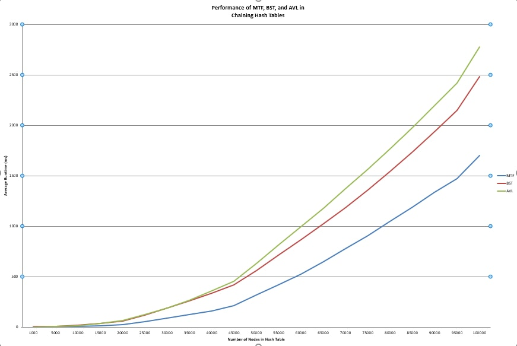
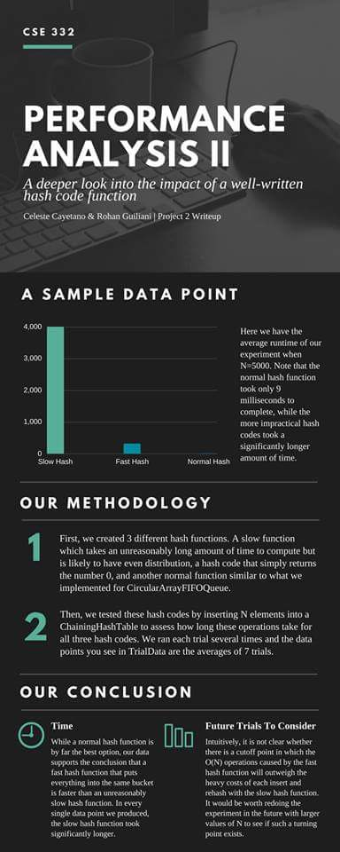
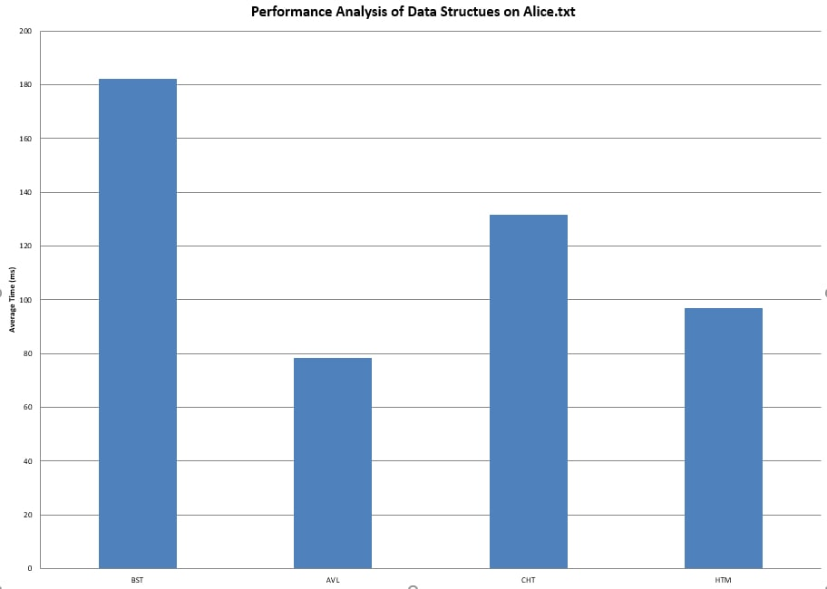

# Project 2 (uMessage) Write-Up #
--------

## Project Enjoyment ##
- What was your favorite part of the project? Why?
  <pre>
  Celeste: My favorite part of the project was implementing ChainingHashTable 
  because it was cool to pull the curtain back and see how hash tables get 
  implemented. It was also impressive to write tests to see just how much faster
  they can be compared to other dictionaries. 
  
  Rohan: My favorite part was the process of designing AVL. It was challenging 
  but rewarding to understand how it works.
  </pre>

- What was your least favorite part of the project? Why?
  <pre>
  Both of our least favorite parts of the project were the vague assignments 
  where it wasn't entirely clear what we were supposed to do and there wasn't 
  much support in lecture, namely replacing the dependency in HashTrieMap. 
  </pre>

- How could the project be improved? Why?
  <pre>
  The project could be improved by either giving clear instructions on the more
  vague parts or giving more support/instruction on piazza/lecture/section so 
  that we don't have to waste as much time figuring out what we are supposed
  to do in the first place. In certain places, like ChainingHashTable, it was 
  good to have little instruction because it forced us to think about the 
  implementation, but this was supplemented by some help in lecture.
  </pre>

- Did you enjoy the project?  Why or why not?
  <pre>
  Overall, we found the project really frustrating at times but we are both glad
  that we got through it. It wasn't enjoyable while we were doing it but in hindsight
  it was a good project. It was awesome seeing everything put together in an almost
  industry grade chat application--taking form in something we use on a daily basis. 
  </pre>
    
-----

## Experiments ##
Throughout p1 and p2, you have written (or used) several distinct implementations of the Dictionary interface:
 - HashTrieMap 
 - MoveToFrontList
 - BinarySearchTree
 - AVLTree
 - ChainingHashTable
 
 In this Write-Up, you will compare various aspects of these data structures.  This will take a significant amount of
 time, and you should not leave it to the last minute.  For each experiment, we expect you to:
 - Explain how you constructed the inputs to make your conclusions
 - Explain why your data supports your conclusions
 - Explain your methodology (e.g., if we wanted to re-run your experiment, we would be able to)
 - Include the inputs themselves in the experiments folder
 - Include your data either directly in the write-up or in the experiments folder
 - You should include graphs of the outputs for at least a few of the questions.
   You can add a link to an image following the instructions found here:
https://courses.cs.washington.edu/courses/cse332/18wi/handouts/markdown.pdf
An example can also be found at the end of this file.
 - We recommend that you keep your "N" (as in "N-gram") constant throughout these experiments. (N = 2 and N = 3 are reasonable.) 
 - You should probably run multiple trials for each data point to help remove outliers.
 - You should not need to wait for hours and hours for your program to run in
 order to answer a question.  Do use large values for N, but not so large that 
 you are waiting overnight for your program to run (N=1,000,000 is likely larger 
 than you need.).

### BST vs. AVLTree ###
Construct inputs for BST and AVLTree to demonstrate that an AVL Tree is asymptotically better
than a Binary Search Tree. Comparing the worst case for each structure is fine here. 
To do this, we expect you to show trends.  You might consider fitting a curve to
your results. Explain your intuition on why your results are what they are.
<pre>
We placed all of our tests inside of a class--BSTTrials.java. We create a variety of 
factors in the tests, including testing sample and multiple trials per test. To test 
the trees themselves, we constructed a loop that iterates from 0 to n where n is the
 desired size of the tree and inserts the number. Hence, the independent variable was the 
 size of the tree, and the dependent variable was the time it took to perform insert. Since the 
 numbers are strictly increasing, it creates a worst-case scenario for BST (essentially a linked list 
 on the right side of the tree). We printed the results and pasted them into Excel 
 where we were able to plot the points and create graphs. The results definitely showed 
 AVL is asymtotically better than BST as the graph below shows. This must be because 
 AVL ensures log(n) time for finds and inserts, whereas BST is linear time for these operations. 

</pre>

### ChainingHashTable ###
Your ChainingHashTable should take as an argument to its constructor the type of "chains" it uses.  Determine
which type of chain is (on average, not worst case) best: an MTFList, a BST, or an AVL Tree.  Explain your intuition on why
the answer you got makes sense (or doesn't!). 

<pre>
We constructed our inputs by first choosing values of n that increment by 5,000 up to 100,000 
to be able to pinpoint any turning points in the data. Then, for each value of n we ran the 
same tests on a ChainingHashTable that uses a MoveToFrontList, one that uses a BinarySearchTree, 
and one that uses an AVLTree. Each trial consists of running the test a total of 10 times and 
throwing out the first 3 "warm-up" tests. So, each data point in the trial data is the average 
time of the last 7 trials. We chose to measure timing rather than counting operations to account 
for the fact that some operations take longer than others.

As for the tests being run, we add n elements to the chaining hash table out of sorted order to 
assess the average case for all the data structures. Then, we call find on an element that we know 
exists, find on an element that is not there, and an insert to replace an item that is pre-existing. 
Since these are the main functions of a chaining hash table, these operations in the average case 
are an appropriate measure of the performance of the different dictionary types. 

In our data, in all three trials, the MTF list performed roughly 150% faster than AVL and 
BST in the N=100,000 case. Although the gap in performance between the 2 data structures 
decreased as N increased, the performance of the MTF was clearly faster. Between the BST 
and AVL, the results were very similar with the BST slightly outperforming the AVL tree. 
(See TrialData file for all data points).

Our intuition for why this performance makes sense is that the buckets inside a chaining hash table 
are designed to be small in comparison to N. So, the time that BST and AVL put into sorting every 
insert has a logarithmic cost compared to MTF's constant time insert. So, after inserting N elements, 
the time difference intuitively would put MTF lists at a significant advantage. In order to have a 
more holistic view of the performance, we also find N elements, to see if the time difference of a 
quicker find would outweigh the time to insert. The worst case in a MTF list is finding an element 
that is not there, so for half of the finds we find an element that is there, and half the time we 
find an element that is not there, to measure the average case of a find operation. However, we found
 that the MTF list still significantly outperformed AVL and BST. Our intuition as to why is that the 
 bucket sizes are small so the linear search will be over a small portion of N. Our intuition as to why 
 BST slightly outperformed AVL is that AVL has extra operations per inserts that require rotations. 
 In the worst case, AVL's balancing property makes a difference, but will make a smaller difference in 
 the average case, so it is likely the case that the rotation operations did not outweigh the faster find 
 operation.
 
</pre>

 
 
 
### Hash Functions ###
Write a new hash function (it doesn't have to be any good, but remember to include the code in your repository).
Compare the runtime of your ChainingHashTable when the hash function is varied.  How big of a difference can the
hash function make (on average, not worst case)?  (You should keep all other inputs (e.g., the chain type) constant.)  Explain your intuition on
why your results are what they are.
<pre>
Hash functions can definitely make a huge difference! We created two different hash functions, 
one which was incredible easy to compute but wasn't effective (just returned a constant) 
(call it function "A") and one which was incredibly difficult to compute but was more "effective" for 
hashing (function "B"). All other variables were kept constant (such as chain type). 
We compared these to some normal hash function, and used String's hash function for this. 
Both functions A and B were slower than normal hashcode as expected, and furthermore, 
function A was much faster than function B. We believe this is because the cost of a conflict 
inside the ChainingHashTable itself is less costly than computing our slow hash function. 
The simple results are included in the TrialData file in the experiments folder.
</pre>

### General Purpose Dictionary ###

<pre>
In order to compare the performance of these 4 Dictionaries, we designed an experiment that
tests the runtime of one practical use of a Dictionary -- counting the word frequencies in a text file. 
We first parsed Alice.txt and stored each word as a key with a word count as the value. Then, we searched
the dictionary to see how many times the word "Alice" was used (fun fact: the answer is 379!). 
Our independent variable was the type of Dictionary used to store the word frequencies, and our
dependent variable was the average time taken to complete the operation. We made sure to make everything 
else the same, including the file being parsed and the parsing operations. See AliceTest.java for our full
testing code.

Though the code was almost exactly the same and only differed in the type of Dictionary being 
used, we found that among the 10 trials, AVL performed the operations the fastest, followed closely 
HTM, which performed notably faster than CHT and BST. On average, AVL performed 2x as fast as BST. 
Since our parser method required inserting and finding in the Dictionary N times, we can conclude that 
whichever Dictionary is fastest on average between inserting and finding at a large N is a good 
candidate for a general purpose Dictionary. Therefore, our data supports the conclusion that AVL 
is a good general purpose Dictionary.

We did expect intuitively for AVL to outperform BST because BST does not guarantee a balanced
property, and we saw in the AVL vs BST test that as BST approaches the worst case, the difference in 
performance grows significantly. However, it was surprising to see that AVL outperformed even the 
HashTrieMap and the ChainingHashTable. Since the number of words in Alice.txt is quite large, it 
could be the case that ChainingHashTable's rehash function was costly enough to make a difference in
the runtime. As for HashTrieMap, there was a very small difference in time so it could be due to the
time required to convert every word into an AlphabeticString before inserting it into the Dictionary.

</pre>

### uMessage ###
Use uMessage to test out your implementations.  Using N=3, uMessage should take less than a minute to load using
your best algorithms and data structures on a reasonable machine. 

 -  How are the suggestions uMessage gives with the default corpus? (here we mean spoken.corpus or irc.corpus, not eggs.txt)
    <pre>
    The suggestions make sense and follow normal English rules. However, they 
    are a bit repetitive and can lead to some circular sentences. Otherwise 
    very fun to play with.
    </pre>

 - Now, switch uMessage to use a corpus of YOUR OWN text. To do this, you will need a corpus. 
   You can use anything you like (Facebook, google talk, e-mails, etc.)  We provide
   instructions and a script to format Facebook data correctly as we expect it will be the most common
   choice.  If you are having problems getting data, please come to office hours and ask for help.
   Alternatively, you can concatenate a bunch of English papers you've written together to get a corpus
   of your writing.  PLEASE DO NOT INCLUDE "me.txt" IN YOUR REPOSITORY.  WE DO NOT WANT YOUR PRIVATE CONVERSATIONS.
     * Follow these instructions to get your Facebook data: https://www.facebook.com/help/212802592074644
     * Run the ParseFBMessages program in the p2.wordsuggestor package.
     * Use the output file "me.txt" as the corpus for uMessage.
 
 - How are the suggestions uMessage gives wth the new corpus?
 
 <pre>
 The word suggestions sound a lot more like how I normally speak, but the word bank seems to be smaller than  the default corpus. As a result, the words suggested can be quite repetitive, even if the sentences are more likely to be things I would actually say.
 </pre>
   <pre>TODO</pre>

-----

A sample image:

To show you how it is done.

## Above and Beyond ##
-   Did you do any Above and Beyond?  Describe exactly what you implemented.
 <pre>
	Yes, we tried our hand at MoveToFrontList delete. We didn't get a lot of time to test it thoroughly, but it was pretty straight forward. 
</pre>
